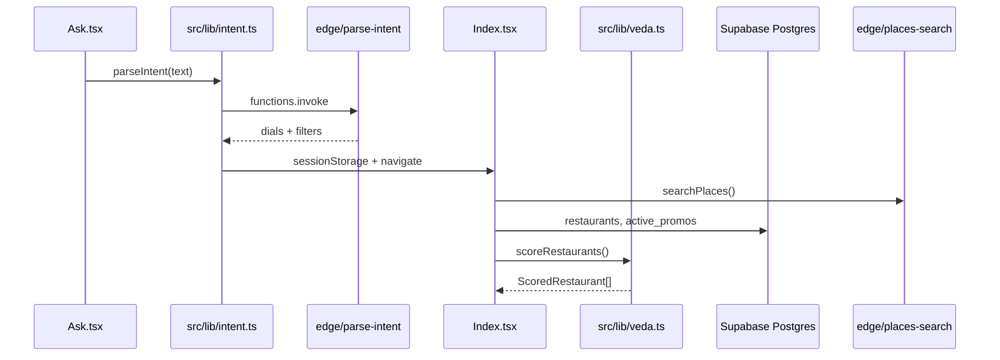

# Rasaoi Outcome Engine — Context Plan

> Single source of truth for AI agents and developers. Every path below was verified on `main`.
> **Read this file before any code change.** Update when architecture shifts.

```yaml
last_verified_commit: pending-ROE-035-impl
last_verified_date: 2026-09-07
branch: feature/ROE-035-llm-call-telemetry
update_policy: "Update when adding routes, edge functions, tables, or cross-module sync pairs"
recent_notes: >
  ROE-035: Edge rasaoi_llm_attempt/summary logs + parse-intent llm meta + client intent_llm_summary.
  Next free: ROE-036.
```

---

## A. Product Summary

**Rasaoi Outcome Engine** is an agentic AI dining concierge for El Dorado Hills / Folsom, CA. It maps natural-language intent (voice or text) into **ranked restaurant outcomes** with explainable **triple plates** (Base / Booster / Carrier) — not endless menu browsing.

**Core domain terms:**

| Term | Meaning |
|------|---------|
| Veda | AI reasoning persona; parses intent into structured dials + filters |
| Dials | Four sliders (0–100): energy, context, budget, purity |
| Reading | Outcome screen — ranked restaurants + hero/alternate dishes |
| Triple Outcome | Three labeled picks per venue (Best / Clean & Vital / Heritage) + carrier — see `buildTripleOutcome` |
| Culinary matrix | Offline EDH/Folsom dish index (`src/data/culinary-index.json`) — prices, macros, course; **ROE-019:** per-dish `identity` (proteins, diet_class, cuisine_region, food_type, dish_role) — trust over tree-root protein family when set; no Gemini at score time |
| Ask-fulfillment | Venue rank + Best plate maximize catalog fulfillment of the Ask (ROE-019); vibe dials secondary |
| Purity tiers | `sovereign` / `standard` / `satellite` — oil/grain/integrity scoring |
| Vitality Twin | Local bio-aware memory (cuisine prefs, vitality score) |
| Blood-sugar lens | Glycemic re-ranking + carrier swaps |
| Dietary gates | Strict filters (Jain, vegan, halal, kosher, etc.) — DIET-001 |
| Lab | Internal operator UI for menu ingest and dish QA |
| Fulfillment | Handoff to dine-in / pickup / delivery platforms |

---

## B. Architecture (Verified Split)

| Layer | Path | Role |
|-------|------|------|
| Frontend | `src/` | Vite/React 18 SPA — UI, routing, client scoring engines |
| Backend | `supabase/` | Postgres migrations + 5 Deno edge functions |
| Ops scripts | `scripts/personal/` | Personal Supabase seeding only (not shared migrations) |
| Static | `public/` | `robots.txt`, `placeholder.svg` |
| Config | Root | `package.json`, `vite.config.ts`, `tailwind.config.ts`, `vercel.json` |

**Entry chain:** `index.html` → `src/main.tsx` → `src/App.tsx`

**There is no standalone Node/Express REST server in this repo.**

---

## C. Request Flow (Ask → Reading → Outcomes)



**Lab flow (operator):** `Lab.tsx` → `ingest-menu` (scrape + parse) → review → `commit-dishes` (DB write).

---

## D. Verified File Index (Canonical Ownership)

| Domain | Canonical files |
|--------|-----------------|
| Intent parsing | `src/lib/intent.ts`, `src/lib/intentSanitize.ts`, `supabase/functions/parse-intent/index.ts` (ROE-017 `exclude_ingredients`) |
| Restaurant scoring | `src/lib/veda.ts`, `src/lib/vedaDishes.ts` |
| Culinary matrix index | `src/lib/culinaryIndex.ts`, `src/data/culinary-index.json` (built by `scripts/personal/build-culinary-index.mjs`; **ROE-019** identity via `enrich-culinary-identity.mjs` + matrix course `identity`) |
| Ask-fulfillment ranking | `veda.ts` fulfillmentScore + `pairings.ts` Ask-aligned picks — see `.cursor/rules/ask-fulfillment.mdc` |
| Catalog plate gate | `src/lib/catalogGuard.ts` — menu ∪ matrix membership before plate return |
| Experimental dynamic knowledge **(SANDBOX)** | `src/lib/experimental/culinaryKnowledge.ts` — static default; Postgres/vector only when flagged |
| Experimental nutrition loop **(SANDBOX)** | `src/lib/experimental/nutrition.ts`, `nutritionQuarantine.ts`, `glycemicLensAdapter.ts`, `scripts/experimental/nutrition-deconstruction.mjs` |
| Experimental telemetry read-path **(SANDBOX)** | `src/lib/experimental/telemetryFeedback.ts` — browser blocked; service-role scripts + `experimental:telemetry-guardrails` |
| Experimental menu sync **(SANDBOX)** | `scripts/experimental/sync-menus-from-sources.mjs`, `export-menu-targets.mjs`, Actor `apify-rasaoi-menu-sync/` — upserts knowledge only unless promote flags |
| Dish intent tokens | `src/lib/dishIntent.ts` — oceany/coastal + **sweet/dessert** synonym expansion (CRS-003, ROE-001) |
| Dietary gates **(SYNC PAIR)** | `src/lib/dietary.ts` ↔ `supabase/functions/_shared/dietary.ts` |
| Triple outcomes | `src/lib/pairings.ts`, `src/components/TripleOutcome.tsx` |
| Glycemic lens | `src/lib/glycemic.ts`, `supabase/functions/estimate-glycemic/index.ts` |
| Places search | `src/lib/google-places.ts`, `supabase/functions/places-search/index.ts` |
| Menu ingest | `src/pages/Lab.tsx`, `supabase/functions/ingest-menu/index.ts`, `supabase/functions/commit-dishes/index.ts` |
| Supabase client | `src/integrations/supabase/client.ts`, `src/integrations/supabase/types.ts` |
| Local memory | `src/lib/memory.ts` (Vitality Twin, Mitra Pact, bio consent) |
| Outcome telemetry | `src/lib/outcomes.ts`, `src/lib/device.ts` |
| Social proof | `src/lib/socialProof.ts` |
| AI client (server) | `supabase/functions/_shared/ai-client.ts` |
| Model router **(LIVE on staging)** | `supabase/functions/_shared/model-router.ts` — used by parse-intent, estimate-glycemic, ingest-menu; Gemini fallback |
| Experimental dynamic culinary **(LIVE when flag on)** | `src/lib/experimental/culinaryRuntime.ts` + `experimental_dish_knowledge` overlay via `setCulinaryLookupOverlay` |
| Experimental Apify webhook | `supabase/functions/experimental-apify-webhook/` — single + batch upsert → speculative knowledge |

**Frontend pages:** `src/pages/Ask.tsx`, `Index.tsx`, `Lab.tsx`, `NotFound.tsx`

**Domain components (17):** `HeroCard`, `MiniCard`, `TripleOutcome`, `Dial`, `CuisineFilter`, `RestaurantSearch`, `RestaurantCard`, `FulfillmentSheet`, `CheckinBanner`, `IntentPill`, `VitalityPanel`, `BioConsentModal`, `MitraPact`, `MicCapture`, `DietBadge`, `PurityIcon`, `NavLink` — all under `src/components/`.

**UI primitives:** `src/components/ui/` — shadcn/Radix (~45 files). Do not hand-roll replacements.

---

## E. Routes

From `src/App.tsx`:

| Path | Page | Purpose |
|------|------|---------|
| `/` | `Ask.tsx` | Intent input (voice + text) |
| `/reading` | `Index.tsx` | Veda's Reading — ranked outcomes |
| `/lab` | `Lab.tsx` | Internal QA + menu ingest |
| `*` | `NotFound.tsx` | 404 catch-all |

New routes must be added **above** the `*` catch-all in `App.tsx`.

---

## F. Database (Postgres via Supabase)

**Migrations:** 12 files in `supabase/migrations/` (add-only — never edit applied migrations).

**Experimental (staging):** `supabase/migrations_experimental/` — apply with `npm run experimental:apply-schema` on Supabase **`aotlzhdgnvovvqxmgyyx`** only. Never part of prod `db push`. Includes pgvector knowledge, staging RLS, nutrition quarantine upsert, feedback check-in update. Staging site: https://rasaoi-i8.vercel.app — `docs/experimental/STAGING_PREVIEW_SETUP.md`. Docker optional and currently unused.

| Table | Purpose |
|-------|---------|
| `restaurants` | Venues + `menu_items` JSONB, purity/oil/grain; **phone** / **address** (ROE-009, nullable) + `location_neighborhood` |
| `dishes` | Parsed dish attribute graph (DIET-001 taxonomy) |
| `restaurant_sources` | Menu ingest source URLs |
| `dishes_feedback` | Operator dish QA feedback |
| `active_promos` | Flash deals |
| `outcome_selections` | Fulfillment telemetry + check-ins |

**RPC:** `record_outcome_checkin()` — SECURITY DEFINER check-in updates.

**RLS patterns:**
- Public SELECT on catalog tables (`restaurants`, `dishes`, `active_promos`, etc.)
- `outcome_selections` — insert-only (no public SELECT)
- `dishes_feedback` — no public policies

**Types:** `src/integrations/supabase/types.ts` — regenerate after schema changes.

---

## G. Edge Functions (Deno)

All JWT-disabled per `supabase/config.toml`. Invoked at `{SUPABASE_URL}/functions/v1/{name}`.

| Function | File | Purpose | Secrets |
|----------|------|---------|---------|
| `parse-intent` | `supabase/functions/parse-intent/index.ts` | Gemini tool-calling → dials + filters | `GEMINI_API_KEY` |
| `estimate-glycemic` | `supabase/functions/estimate-glycemic/index.ts` | Batch glycemic load estimates | `GEMINI_API_KEY` |
| `places-search` | `supabase/functions/places-search/index.ts` | Google Places or mock fixtures | `GOOGLE_PLACES_API_KEY` (optional) |
| `ingest-menu` | `supabase/functions/ingest-menu/index.ts` | Firecrawl scrape → Gemini parse | `GEMINI_API_KEY`, `FIRECRAWL_API_KEY` (optional) |
| `commit-dishes` | `supabase/functions/commit-dishes/index.ts` | Insert dishes + rebuild `menu_items` | Auto: `SUPABASE_URL`, `SUPABASE_SERVICE_ROLE_KEY` |
| `score-reading` | `supabase/functions/score-reading/index.ts` | **[ROE-026]** J recompute from `jComponents` (dual-run) | none (rate-limited) |

**Shared:** `supabase/functions/_shared/ai-client.ts`, `supabase/functions/_shared/dietary.ts`, `supabase/functions/_shared/intent-sanitize.ts`, `supabase/functions/_shared/score-weights.ts` (ROE-025 J incl. S; Edge score-reading ROE-026), experimental `supabase/functions/_shared/model-router.ts` (unused by prod deploy until promotion).

**Deploy:** `npm run supabase:deploy:all` (prod 5). Staging also: `npm run supabase:deploy:experimental` (+ `experimental-apify-webhook`).

---

## H. Cross-Module Invariants (Anti-Hallucination)

1. **`WELLNESS_TAG_SLUGS`** in `src/lib/veda.ts` must match `parse-intent` output slugs: `raw`, `fresh`, `gut_friendly`, `light`, `low_oil`, `probiotic`.
2. **`dietary.ts` sync pair** — exists in exactly two places; both must change together:
   - `src/lib/dietary.ts`
   - `supabase/functions/_shared/dietary.ts`
2b. **`intentSanitize` sync pair** — transcript cuisine / dietary / lens / sweet helpers:
   - `src/lib/intentSanitize.ts`
   - `supabase/functions/_shared/intent-sanitize.ts`
2c. **`scoreWeights` sync pair** — named J (F/D/P/B/W/**S**/G); gate: `npm run ci:twins`:
   - `src/lib/scoreWeights.ts`
   - `supabase/functions/_shared/score-weights.ts`
3. **Mock fixtures sync pair:**
   - `src/testing/mock-places.json`
   - `supabase/functions/places-search/fixtures/mock-places.json`
4. **No `useQuery` / `useMutation`** in `src/` — data fetched imperatively via `useEffect` + Supabase client.
5. **TanStack Query** — `QueryClientProvider` in `App.tsx` is unused scaffolding.
6. **Scoring changes** require regression tests in `src/lib/*.test.ts`.
7. **`parse-intent` SYSTEM_PROMPT** and client scoring (`veda.ts`, `pairings.ts`) must stay aligned on dietary/wellness/cuisine behavior.
8. **Gemini edge AI:** `_shared/ai-client.ts` uses `gemini-flash-latest`; strip `additionalProperties` from tool schemas; `geminiToolCall` returns a parsed object (not a JSON string).
9. **Triple outcomes:** CRS-003 coastal rules + **ROE-001** sweet/dessert mode (`isSweetDishIntent`, no carrier on mithai). See `docs/ROE-001-sweet-dessert-impact-analysis.md`.
10. **CONTEXT_PLAN.md** must remain in the repo on every push (CI checks existence) — prefer it over deep-dives.
8. **Culinary index rebuild:** when `el_dorado_folsom_culinary_matrix.json` or EDH/Folsom rows in `dish_registry.json` change, run `node scripts/personal/build-culinary-index.mjs` and commit `src/data/culinary-index.json`. Do not import the raw multi-MB sources into the SPA.

---

## I. Environment Split

**Frontend (Vite `.env`):** see `.env.example`
- `VITE_SUPABASE_URL`
- `VITE_SUPABASE_PUBLISHABLE_KEY`
- `VITE_SUPABASE_PROJECT_ID`
- `VITE_USE_MOCK_PLACES` (optional)
- `VITE_GOOGLE_PLACES_API_KEY` (optional, atypical)

**Edge secrets (Supabase CLI — not in `.env`):**
- `GEMINI_API_KEY` — required for AI functions
- `GOOGLE_PLACES_API_KEY` — optional (mock fallback)
- `FIRECRAWL_API_KEY` — optional (HTML fallback in ingest)

**Never commit:** `.env`, `.env.experimental`, service role keys, client Lovable credentials.

**Experimental staging:** Live at https://rasaoi-i8.vercel.app with features ON — see `docs/experimental/FULL_STAGING_GO_LIVE.md` + `STAGING_PREVIEW_SETUP.md`. Edge AI goes through `_shared/model-router.ts` (Gemini fallback). Dynamic culinary uses `experimental_dish_knowledge` overlay when `VITE_EXPERIMENTAL_DYNAMIC_CULINARY=true`. Apify cron → webhook → speculative knowledge only (see `APIFY_CLI_CRON_SETUP.md`). Never write experimental data to prod `kiugplotjcnmpwjlxajc`.

---

## J. Commands

| Command | Purpose |
|---------|---------|
| `npm run dev` | Vite dev server (port 8080) |
| `npm run build` | Production build |
| `npm test` | Vitest unit tests |
| `npm run experimental:sim` | Adversarial simulator (≥98% gate; 520 seeds) |
| `npm run experimental:expand-corpus` | Regenerate chaotic seed corpus |
| `npm run experimental:nutrition` | USDA nutrition deconstruction CLI |
| `npm run experimental:verify-telemetry-loop` | Dry-run (or `--live`) check-in → feedback → guardrails proof |
| `npm run experimental:export-menu-targets` | Export Folsom/EDH Indian menu targets |
| `npm run experimental:sync-menus` | Mirror/scrape → knowledge; promote needs flags |
| `npm run experimental:apify-push` | Push Apify Actor (`npx apify-cli`) |
| `npm run experimental:apify-cron-setup` | Create/update weekly Apify schedule |
| `npm run experimental:apply-schema` | Apply `migrations_experimental/` on staging |
| `npm run experimental:backfill` | Backfill `experimental_dish_knowledge` |
| `npm run supabase:db:push` | Apply migrations to linked project |
| `npm run supabase:deploy:all` | Deploy prod 5 edge functions |
| `npm run supabase:deploy:experimental` | Prod 5 + `experimental-apify-webhook` |
| `npm run sync:lovable` | Pull upstream + db push + deploy |

**CI/CD:** GitHub Actions — `.github/workflows/ci-cd.yml` (lint → test → build → Vercel). Staging: `.github/workflows/deploy-staging-preview.yml`. See `.github/DEPLOYMENT.md`.

**Production frontend:** Vercel — https://rasaoi-delta.vercel.app  
**Staging frontend:** Vercel — https://rasaoi-i8.vercel.app

---

## K. Authoritative External Docs

Defer to these for feature status — not model memory:

| Doc | Content |
|-----|---------|
| `TODO.md` | Feature roadmap + ticket IDs (CRS-*, ROE-*, DIE-*, MIG-*, DIET-*) |
| `.lovable/plan.md` | Current surgical fix plan |
| `Docs/` | Impact analyses + `docs/experimental/` (staging runbooks, EXP tickets, Apify cron) |
| `TODO_PROGRESS.md` | ROE-016 staging checklist (live features + soak gate) |
| `MIGRATE_SYNC_README.md` | Lovable ↔ personal Supabase workflow |
| `CONFLICT_RESOLUTION_REPORTS.md` | Resolved bugfix engineering log |
| `scripts/personal/README.md` | Personal data seeding runbook |

---

## L. Does Not Exist (Do Not Invent)

- No `AGENTS.md` at repo root
- No Next.js — this is Vite SPA only
- No Redux, Zustand, or global state store
- No axios or custom fetch wrapper layer
- No standalone REST/Express server in-repo
- No edge function integration tests (use `Lab.tsx` for manual QA); experimental Vitest covers `src/lib/experimental/**` only
- No `useQuery`/`useMutation` usage despite TanStack Query being installed
- No production wiring of `migrations_experimental` until promotion checklist; **staging** already runs model-router + experimental schema on `aotlzhdgnvovvqxmgyyx` / rasaoi-i8

**Guard rules that do exist:** `.cursor/rules/context-guard.mdc`, `hallucination-guard.mdc`, `roe-ticket-flow.mdc`, `frontend.mdc`, `backend.mdc`

**Hallucination guard impact:** `docs/ROE-016-hallucination-guard-impact-analysis.md` — dish-non-invention, speculation tiers, adversarial sim GATE PASS (520@100%); develop merge still needs formal soak.

**If a file, API, or table is not listed here, search the repo before assuming it exists.**

---

## M. Maintenance Protocol

**ROE ticket flow (standing):** `.cursor/rules/roe-ticket-flow.mdc` — audit → impact → approve → branch → implement + tests → sync plan/TODO/CONTEXT/CURSOR + **`docs/ROE-upgrade-story.md`** → PR/board. Next free serial: **ROE-030**.

| Trigger | Action |
|---------|--------|
| New route/page | Update §E + `src/CURSOR.md` |
| New edge function | Update §G + `supabase/CURSOR.md` + `package.json` deploy script |
| New DB table/column | New migration + update §F + regenerate `types.ts` |
| New sync pair | Add to §H + both CURSOR.md files |
| Bugfix with ticket ID | Log in `CONFLICT_RESOLUTION_REPORTS.md` |
| Lovable sync | Re-audit file tree; bump `last_verified_commit` in header |

---

## N. Scoped Agent Guides

- **Frontend/UI changes:** read `src/CURSOR.md`
- **Backend/Supabase changes:** read `supabase/CURSOR.md`
- **Guard rules:** `.cursor/rules/context-guard.mdc` + `hallucination-guard.mdc` + `roe-ticket-flow.mdc` (always), `frontend.mdc`, `backend.mdc`
